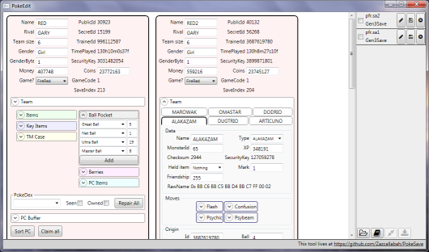

PokeSave
========
PokeSave, working title, intends to be an easy and intuitive tool for editing Pokemon save files. Currently it only supports generation 3 games, and I have only tested it on emulator 128k saves.

Roadmap
-----
* Add support for just adding pkm-file.
* Automatically recognize what file is opened.
* Introduce storage concept.
* Add support for parsing gen4 savegames and gen4 save files
* add support for parsing gen5 savegames and gen5 save files
* add support for conversion between all those
* add gts support for easier pkm extraction
* Figure out catchy name

Minor TODO
--------
* add 'drop files here' sign.

Notes, Gen III
----
* There are still some save sections that aren't mapped, or have been mapped but not added to this app. There is also a few parts of the pokemon substructures that haven't been added yet. Ribbons, Box names, and wallpapers, I'm probably forgetting others.
* Some of the read-only fields could become writable. Time needs to be parsed in some way though.
* Level met doesnt show properly
* location met could use combo box with valid values
* Trying to change gender for certain types crashes (shouldn crash, may still be invalid)
* some stats are zero?
* language needs combo? - nah
* add a bunch of typeinformation info
* Show filename somewhere
* Test pokedex seen and owned. Why are the different seen fields set?
* test set national? repair, section, merge
* Virus for empty team entry is 255?
* when importing multiple files, flag that not all were importen / look for invalid data / check if length is ok and tell user if not

coin
bps?
pkm file
fateful encounter
setting spinda spots - without editing rest?
unown letter
stats generation from iv and ev
hidden power
met location list
language list
second charset
rtc edit

0:898 - last screens?
3:280 - loads of encrypted 0

Testing and code coverage
-------------------------
There are nunit tests in the cleverly named TestProject1 project.
I used OpenCover and ReportGenerator to generate statistics.
Put all bin-folders into a bin folder in the root of this repo, then run runtests.bat

* https://github.com/sawilde/opencover/
* http://reportgenerator.codeplex.com/
* http://www.nunit.org/

Thanks and sources
------------------
* [Project Pokemon](http://projectpokemon.org/wiki/Main_Page)
* [Bulbapedia](http://bulbapedia.bulbagarden.net/wiki/Save_data_structure_in_Generation_III)
* [KazoWAR](http://projectpokemon.org/forums/showthread.php?31254-A-Save-(3rd-Generation-Save-Editor))
* [kpdavatar](http://www.ppnstudio.com/maker/PokemonMakerHelp.txt)
* [CodeMonkey85](https://github.com/codemonkey85)
* Kaphotics, OmegaDonut, onyxphase, Bond697, and others from the pp irc
* [Font Awesome by Dave Gandy](http://fontawesome.io)
* [PokeLib](https://github.com/Chase-san/PokeLib)

License
-------
The source code of this application is licensed with a Creative Commons Attribution-NonCommercial-ShareAlike 3.0 Unported License. This does not include any lists of data and names used.
